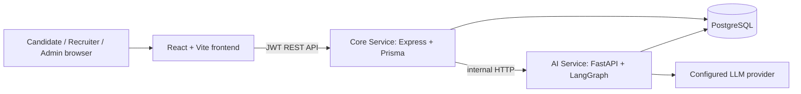

# JobFix Architecture

JobFix is a single application repository with one React frontend, one Express core API, and one internal FastAPI AI service. SmartFresher is not a deployed or maintained application.



## Applications

| Application | Responsibility |
|---|---|
| `apps/frontend` | One role-aware React SPA for candidate, recruiter, and admin experiences. |
| `apps/core-service` | JWT authentication, authorization, business rules, CRUD, persisted analytics, and the public REST API. |
| `apps/ai-service` | Resume parsing, job-description analysis, question retrieval/generation, validation, and assessment evaluation. |

The frontend calls only the Core Service. The Core Service calls the AI Service through `aiServiceClient`; the AI Service is not a browser-facing API.

## Core domains

- Identity: users, JWT authentication, candidate/recruiter/admin roles.
- Candidate: profiles, resume parsing output, skills, applications, assessments, results.
- Recruiter: profile-backed company, job lifecycle, candidate ranking.
- Hiring: job skill extraction, applications, resume match, application-linked assessment.
- Question bank: reusable retrieved questions and generated fallback questions.
- Administration: operational inventories and read-only analytics.

## Important flows

```text
Recruiter login → Company → Job description → AI job analysis → Job skills
Candidate browse → Application → Resume match → Job-skill assessment → Result
Admin → Analytics / Question-bank coverage / operational inventories
```

`AssessmentQuestion.generatedByAi` records the source used for each persisted assessment question. Analytics derives question retrieval and generation rates from that existing data; it does not alter the assessment pipeline.

## Repository layout

```text
jobfix/
├── apps/
│   ├── frontend/       React + Vite application
│   ├── core-service/   Express + Prisma API
│   └── ai-service/     FastAPI + LangGraph service
├── infra/              deployment infrastructure
├── packages/           shared package space
├── docs/               API, ER diagram, migration records
├── ARCHITECTURE.md
└── README.md
```

## Boundaries

- Prisma schema and migrations in `apps/core-service/prisma` are the database source of truth.
- The Core Service owns write-side business rules; no duplicate admin CRUD layer exists.
- The AI Service owns AI orchestration and is reused rather than reimplemented by feature modules.
