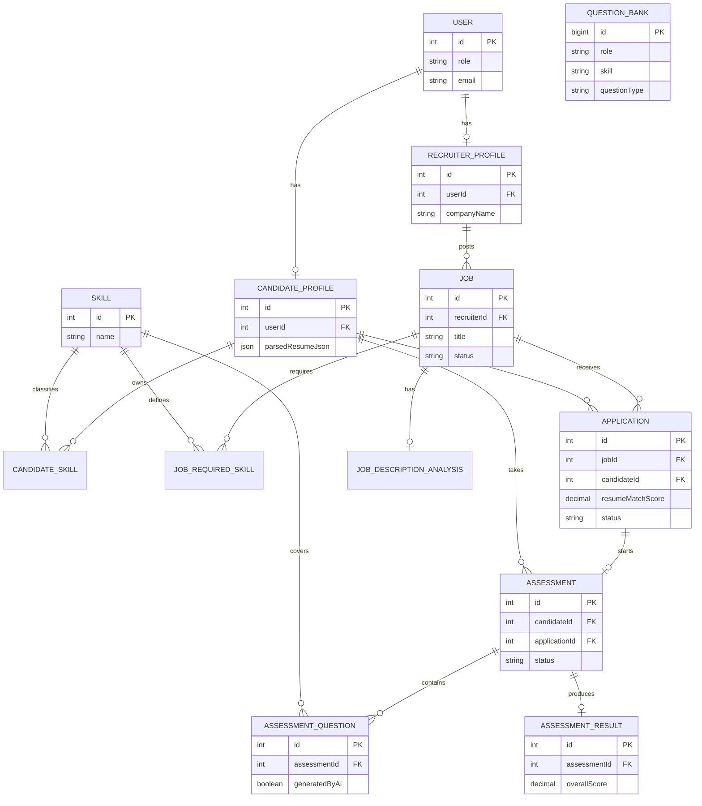

# JobFix ER Diagram

Notes:

- A company is represented by the recruiter’s `RecruiterProfile`; no duplicate Company model exists.
- `Application(jobId, candidateId)` is unique.
- `Assessment.applicationId` is unique when an assessment was created from an application.
- The Question Bank is independent reusable content. Retrieved questions are persisted in `AssessmentQuestion` with `generatedByAi = false`.
